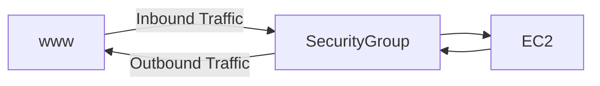

# EC2

- [EC2](#ec2)
  - [Budget](#budget)
  - [EC2](#ec2-1)
    - [Sizing and configuration](#sizing-and-configuration)
    - [EC2 User Data](#ec2-user-data)
    - [EC2 Instance Types](#ec2-instance-types)
  - [EC2 Instance Type](#ec2-instance-type)
    - [General Purpose](#general-purpose)
    - [Compute Optimized](#compute-optimized)
    - [Memory Optimized](#memory-optimized)
    - [Storage Optimized](#storage-optimized)
  - [Security Group](#security-group)
    - [Referencing other security groups](#referencing-other-security-groups)
    - [Security Group with Roles](#security-group-with-roles)
  - [Purchasing Options](#purchasing-options)
    - [On Demand](#on-demand)
    - [Reserved](#reserved)
    - [Savings Plans](#savings-plans)
    - [Spot](#spot)
    - [Dedicated Hosts](#dedicated-hosts)
    - [Dedicated Instances](#dedicated-instances)
    - [Capacity Reservations](#capacity-reservations)

## Budget

root 유저의 account 설정에서 Bill 탭을 클릭하면 현재 사용량을 확인할 수 있습니다.

또한 Budget을 설정하면 사용량이 일정 금액을 넘을 떄 메일로 알림을 받을 수 있습니다.

## EC2

EC2 stands for Elastic Compute Cloud,
which is a service that provides resizable compute capacity in the cloud.

it has capability of

- Renting virtual machines (EC2) : 가상 머신을 빌릴 수 있습니다.
- Storing data on virtual drives (EBS) : 가상 드라이브(EBS 볼륨)에 데이터를 저장할 수 있습니다.
- Distributing load across machines (ELB) : 여러 머신에 부하를 분산할 수 있습니다.
- Scaling the services using an auto-scaling group (ASG) : ASG를 사용하여 서비스를 확장할 수 있습니다.

### Sizing and configuration

- OS : Windows, Linux, MacOS
- CPU
- RAM
- Storage
    - Network attached (EBS, EFS)
    - Hardware (Instance Store)
- Network card
- Firewall rules (security group)
- Bootstrap script (user data)

### EC2 User Data

bootstrap script를 사용하여 EC2 인스턴스를 시작할 때 실행할 명령을 지정할 수 있습니다.
해당 스크립트는 인스턴스가 시작될 때 한 번 실행됩니다.

EC2 user data is used to automate boot tasks such as:

- Installing updates
- Installing software
- Downloading common files from the internet
- etc.

The EC2 User Data Script runs with the root user. (sudo)

### EC2 Instance Types

There are many different instance types, each optimized for different use cases.

| Instance    | vCPU | Mem   | Storage          | Network         | EBS Bandwidth (Mbps) |
|-------------|------|-------|------------------|-----------------|----------------------|
| t2.micro    | 1    | 1GB   | EBS Only         | Low to Moderate |                      |
| t2.xlarge   | 4    | 16GB  | EBS Only         | Moderate        |                      |
| c5d.4xlarge | 16   | 32GB  | 1 x 400 NVMe SSD | Up to 10 Gbps   | 4750                 |
| r5.16xlarge | 64   | 512GB | EBS Only         | 20 Gbps         | 13600                |
| m5.8xlarge  | 32   | 128GB | EBS Only         | 10 Gbps         | 6800                 |

> t2.micro is part of the AWS free tier (up to 750 hours per month)

## EC2 Instance Type

> https://aws.amazon.com/ko/ec2/instance-types/  
> https://instances.vantage.sh/

EC2 Instance has a following naming convention

```
m5.2xlarge
```

- m : instance class
    - more info : https://aws.amazon.com/ko/ec2/instance-types/
- 5 : generation
- 2xlarge : size within the instance class
    - more CPU and RAM

### General Purpose

Instance class for `t`, `m` is a general purpose instance.

it is used for diversity of workloads such as `web servers`, `code repositories`

it has balance of `CPU`, `Memory`, `Networking`

> `t2.micro` is part of the AWS free tier (up to 750 hours per month)

### Compute Optimized

Instance class for `c` is a compute optimized instance.

it is used for `compute-bound` applications that benefit from high-performance processors.

> e.g. `batch processing`, `media transcoding`, `high-performance web servers`,
`high-performance computing (HPC)`, `scientific modeling`, `dedicated gaming servers`

### Memory Optimized

Instance class for `r`, `u`, `x`, `z` is a memory optimized instance.

it is used for `memory-bound` applications that benefit from large data sets in memory.

> e.g. `High performance databases`, `distributed web scale in-memory caches`,
`In-memory databases optimized for BI(Business Intelligence)`,
`applications performing real-time processing of unstructured big data`

### Storage Optimized

Instance class for `i`, `d`, `h` is a storage optimized instance.

it is used for `storage-bound` applications that require
high, sequential read and write access
to very large data sets on local storage.

> e.g. `High frequency online transaction processing (OLTP) systems`,
> `Relational & NoSQL databases`, `Data warehousing applications`,
> `Cache for in-memory databases(Redis)`, `Distributed file systems`

## Security Group

> https://docs.aws.amazon.com/ko_kr/vpc/latest/userguide/vpc-security-groups.html

Security Group은 인바운드 및 아웃바운드 트래픽을 제어하는 방화벽 역할을 합니다.



Security Group only contain `allow` rules.
Security Groups rules can reference by IP or by other security group.

They regulate:

- Access to ports
- Authorize IP ranges (IPv4 and IPv6)
- Control inbound network (from other to the instance)
- Control outbound network (from the instance to other)

| Type            | Protocol | Port Range | Source            | Description       |
|-----------------|----------|------------|-------------------|-------------------|
| HTTP            | TCP      | 80         | 0.0.0.0/0         | Test HTTP traffic |
| SSH             | TCP      | 22         | 122.142.192.15/32 |                   |
| Custom TCP Rule | TCP      | 4242       | 0.0.0.0/0         | Java App          |


* Can be attached to multiple instances
* Lock down to a region/VPC combination
* Does live "outside" the EC2 - if traffic is blocked, the instance won't see it  
  (보안 그룹은 EC2 외부에 있기 떄문에, 트래픽이 차단되면 인스턴스는 해당 트래픽을 볼 수 없습니다.)

> It is Good to maintain one separate security group for `SSH access`

> If application is not accessible with timeout, check the security group rules  
> If application if not accessible with connection refused, check the application

> All inbound traffic is blocked by default,  
> all outbound traffic is authorized by default 

### Referencing other security groups 


서로 다른 인스턴스를 사용하는 경우, 위와 같이 다른 보안 그룹을 참조하여 트래픽을 허용할 수 있습니다.

### Security Group with Roles

EC2 인스턴스에서 다른 AWS 서비스에 액세스하려면 해당 서비스에 대한 권한이 필요합니다.

aws configure 명령을 사용하여 인스턴스에 권한을 부여할 수 있지만,
해당 방법은 해당 인스턴스에 입력된 자격 증명 정보가 탈취될 수 있기 때문에 권장되지 않습니다. 

대신 해당 인스턴스의 Security Group에 Role을 추가하여 권한을 부여하는 것을 권장합니다.

## Purchasing Options

- On Demand : Pay fixed rate by the hour (or by the second) with no commitment
- Reserved : Capacity reservation, significant discount on hourly charge
  - Reserved Instances : 1 or 3 year term
  - Convertible Reserved Instances : Can change the EC2 instance type
- Savings Plans : Commit to an amount of usage (measured in $/hour) for a 1 or 3 year term
- Spot Instances : short workloads, for cheap, can lose instances (less reliable)
- Dedicated Hosts : book an entire physical server, control instance placement
- Dedicated Instances : no other customers will share your hardware
- Capacity Reservations : reserve capacity in a specific AZ for any duration

### On Demand

Billing per second, after the first minute in Linux or Windows, others for per hour.

Has the highest cost but no upfront payment.
(비용이 가장 높지만 선결제가 없습니다)

No long-term commitment.
(장기 약정이 없습니다)

> 단기적이고 중단이 없는 워크로드 또는 예측할 수 없는 어플리케이션에 적합합니다.

### Reserved

Up to 75% discount compared to On-Demand.
(온디맨드에 비해 최대 75% 할인)

Reserve a specific instance attribute, e.g. Instance type, Region, Tenancy, OS 등)

Reservation period : 1 or 3 years

Payment options : No Upfront, Partial Upfront, All Upfront

Reser Instance's Scope : Regional or Zonal(reserve capacity in a specific AZ)

`Convertible Reserved Instances`(전환형 예약 인스턴스)는 인스턴스 타입, OS, Scope 등을 변경할 수 있습니다.

> 사용량이 일정한 어플리케이션에 적합합니다. e.g. Database, Cache, etc.

### Savings Plans

Up to 72% discount compared to On-Demand.
(온디맨드에 비해 최대 72% 할인)

특정 사용량에 대한 약정을 맺고, 해당 사용량이 초과되면 On-Demand 요금을 지불합니다.

Savings Plans을 사용하게 되면 Instance Family와 Region이 고정되지만,
Instance Size, OS, Tenancy 등은 변경할 수 있습니다.

### Spot

Can get a discount of up to 90% compared to On-Demand.
(온디맨드에 비해 최대 90% 할인)

Spot은 최대 가격을 설정하고, 해당 가격을 초과하면 인스턴스가 손실됩니다.

따라서 가장 효율적으로 비용을 절감할 수 있지만, 데이터가 손실될 수 있습니다.

> Spot Instance는 실패시 복구가 가능한 워크로드에 적합합니다. e.g. Batch jobs, Data analysis, etc.  
> 반대로 데이터베이스와 같이 데이터가 손실되면 안되는 워크로드에는 적합하지 않습니다.

### Dedicated Hosts

> [AWS 강의실 - EC2 Dedicated Host vs Dedicated Instance](https://www.youtube.com/watch?v=8WBNKcftlzM)

Physical EC2 server dedicated for your use.
(물리적 EC2 서버를 전용으로 사용)

실제 물리 서버를 예약하기 때문에 가장 비용이 많이 듭니다.

전용 호스트는 자사 보유 라이선스를 활용하여 회사 규정 조건을 해결하는 경우 활용됩니다.

> 예를 들어 `Oracle DB`를 사용하는 경우, CPU 코어를 기준으로 라이선스를 구매해야 하는데,
> 일반적인 On-Demand 인스턴스를 사용하면 사용하는 `vCPU`와 `실제 CPU` 코어가 다르기 때문에
> 라이선스 비용이 더 많이 발생할 수 있습니다.

### Dedicated Instances

> [AWS 강의실 - EC2 Dedicated Host vs Dedicated Instance](https://www.youtube.com/watch?v=8WBNKcftlzM)

Instances running on hardware that's dedicated to you.
(전용 인스턴스는 전용 하드웨어에서 실행됩니다.)

하지만 전용 호스트와는 다르게 물리적 서버를 예약하지 않고,
인스턴스를 시작할 때 다른 사용자와 격리된 하드웨어를 할당받아 사용하게 됩니다.

전용 인스턴스는 자사 보유 라이선스를 활용하지 못하기 때문에
보안 규정을 준수해야하거나 물리적 서버의 성능을 보장해야 하는 경우에 사용됩니다.

추가로 같은 AWS 계정의 인스턴스와 하드웨어를 공유할 수 있습니다.


### Capacity Reservations

Reserve On-Demand instance capacity in a specific Availability Zone.
(원하는 기간동안 특정 가용 영역에 대한 On-Demand 인스턴스 용량을 예약합니다.)

인스턴스를 실행하지 않아도 On-Demand 요금을 지불해야 하지만,

기간 약정이나 청구 할인이 없기 때문에 지역별 예약 인스턴스나 Saving Plan과 결합하여 사용할 수 있습니다. 

> 특정한 AZ에 있어야하는 단기적이고 중단 없는 워크로드에 적합합니다.


