# RDS

- [RDS](#rds)
  - [RDS란?](#rds란)
  - [Storage Auto Scaling](#storage-auto-scaling)
  - [Read Replicas](#read-replicas)
  - [Multi AZ](#multi-az)
  - [RDS Custom](#rds-custom)
- [Aurora](#aurora)
  - [고가용성과 레플리카](#고가용성과-레플리카)
  - [Auto Scaling](#auto-scaling)
  - [Custom Endpoints](#custom-endpoints)
  - [Serverless](#serverless)
  - [Global](#global)
  - [Machine Learning](#machine-learning)
- [백업과 복원](#백업과-복원)
  - [백업](#백업)
    - [RDS](#rds-1)
    - [Aura](#aura)
  - [복원](#복원)
    - [Restore options](#restore-options)
    - [Database Cloning](#database-cloning)
- [Security](#security)
- [Proxy](#proxy)
- [ElastiCache](#elasticache)
  - [ElastiCache Solution Architecture](#elasticache-solution-architecture)
    - [DB Cache](#db-cache)
    - [Session Store](#session-store)
  - [Redis vs Memcached](#redis-vs-memcached)

## RDS란?

RDS는 Amazon Relational Database Service의 약자로, 관계형 데이터베이스를 쉽게 설정, 운영 및 확장할 수 있는 웹 서비스입니다. RDS는 MySQL, PostgreSQL, MariaDB, Oracle, MS SQL Server, IBM DB2 및 Amazon Aurora와 같은 여러 엔진을 지원합니다.

RDS는 데이터베이스 관리 작업을 자동화하고, 데이터베이스 엔진의 소프트웨어 패치 및 업그레이드를 자동으로 적용하여 데이터베이스를 쉽게 설정, 운영 및 확장할 수 있습니다.

지속적인 데이터베이스 백업을 지원하여 특정 시점으로 데이터베이스를 복원할 수 있고, 모니터링 대시보드를 통해 데이터베이스 성능을 모니터링할 수 있습니다.

조회 성능을 향상시키기 위해 조회 전용 레플리카(복제본)를 사용할 수 있고, 고가용성을 위해 다중 가용 영역을 설정할 수 있습니다.

인스턴스 유형을 늘려서 수직적으로 확장이 가능하고, 읽기전용 복제본을 추가하여 수평적으로 확장이 가능합니다.

스토리지는 EBS(gp2, io1)를 사용합니다.

한 가지 단점은 SSH를 통해 RDS에 접속할 수 없다는 것입니다.

## Storage Auto Scaling

RDS는 데이터베이스 스토리지가 부족해지면 자동으로 스토리지를 확장하여 데이터베이스 용량을 늘리는 기능을 제공합니다.

스토리지 자동 확장 기능을 사용하기 위해서는 Maxium Storage Threshold를 설정해야 합니다. Maxium Storage Threshold는 데이터베이스 스토리지가 확장되는 최대 용량을 의미합니다.

스토리지 자동 확장되는 경우는 다음과 같습니다.
- 할당된 저장공간이 10% 미만인 경우
- 낮은 저장 공간이 5분 이상 지속되는 경우
- 마지막 수정된 시간으로부터 6시간 지난 경우

예측할 수 없는 업무량을 가진 어플리케이션에 유용합니다.

## Read Replicas

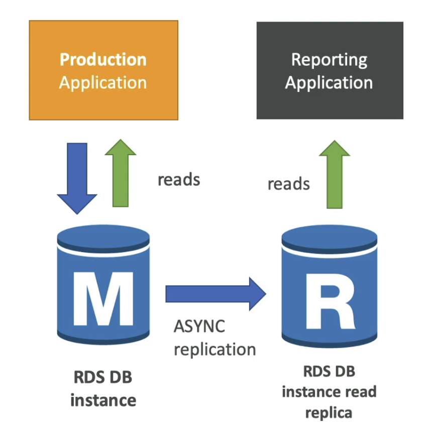

읽기 전용 레플리카는 데이터베이스의 성능을 분산시키기 위해 사용하는 조회 전용 데이터베이스 복제본입니다.

최대 15개의 읽기 전용 복제본을 생성할 수 있습니다.

읽기전용 복제본은 `비동`기식으로 복제를 수행합니다.

읽기전용 복제본은 데이터베이스로 승격이 가능합니다.

읽기전용 복제본은 별도의 엔드포인트를 가지고 있기 때문에 따로 연결해야합니다.

읽기전용 복제본은 `다른 리전에 생성이 가능`합니다.

> read replica는 다중 가용 영역을 지원하기 때문에 재해 복구를 위해 사용할 수 있습니다.

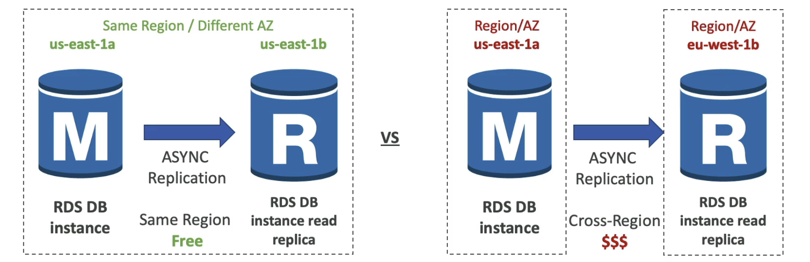

레플리카의 네트워크 비용은 같은 리전인 경우는 무료이지만, 다른 리전인 경우는 비용이 발생합니다.

## Multi AZ

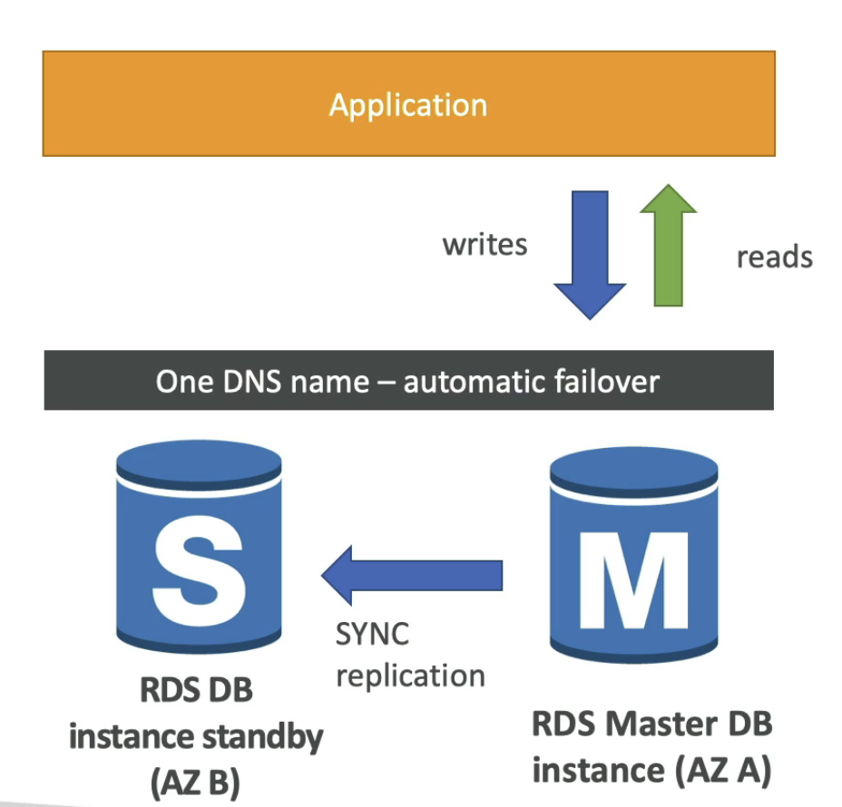

Multi AZ는 다중 가용 영역을 사용하여 데이터베이스의 가용성을 높이는 기능입니다.

Multi AZ를 활성화하면 다른 가용 영역에 원본 데이터베이스와 `동기`식으로 스탠바이 데이터베이스를 생성합니다.

마스터와 스탠바이 데이터베이스는 하나의 DNS를 사용하며 마스터 DB 서버 장애시 스탠바이 DB 서버로 자동으로 연결됩니다.

스탠바이 데이터베이스 단지 장애 대비용으로만 사용되기 때문에 스케일링에 적합하지 않습니다. Multi AZ는 Disaster Recovery를 위한 것이지, 성능 향상을 위한 것이 아닙니다.

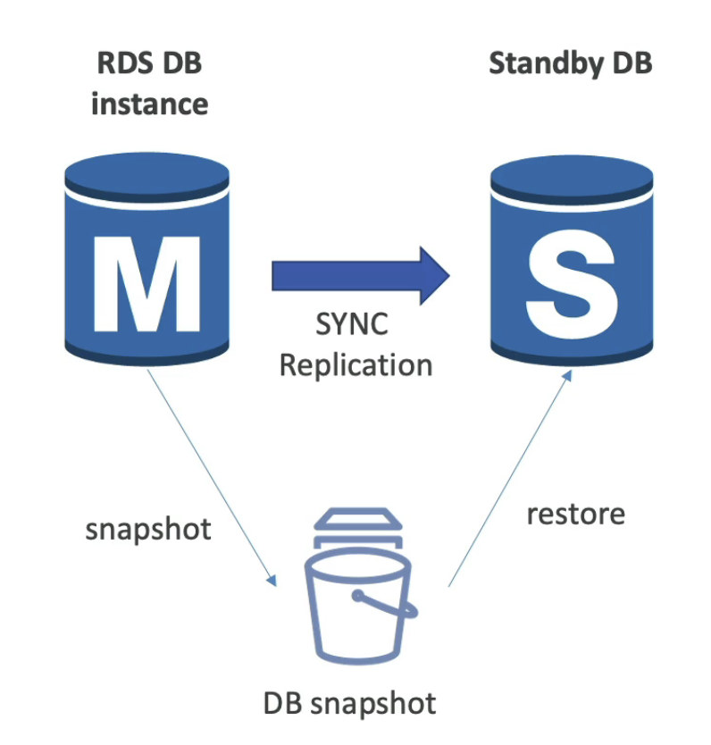

단일 가용영역에서 다중 가용영역으로 전환해도 downtime이 발생하지 않습니다. 즉, 데이터베이스를 전환할 때 데이터베이스를 중지할 필요가 없다는 것입니다.

데이터베이스 설정에서 Multi AZ를 활성화하면 다음과 같은 작업이 수행됩니다.

1. Multi AZ 활성화
2. 원본 데이터베이스 스냅샷 생성
3. 다른 가용 영역에 스냅샷으로 스탠바이 데이터베이스 생성
4. 스탠바이 데이터베이스와 원본 데이터베이스 동기화 설정

## RDS Custom

RDS Custom 옵션은 기저 운영체제나 사용자 정의 기능을 제공합니다.

RDS Custom Oracle과 MS SQL Server에서만 지원하는 기능입니다.

Custom 옵션을 사용하면 RDS에서 제공하는 자동화 기능을 사용하면서 기저 데이터베이스와 운영체제에 접근하여 내부 설정을 구성하거나 네이티브 기능을 홠성화할 수 있습니다.

하지만 Custom 옵션을 사용하면 RDS가 수시로 자동화, 유지 관리 혹은 스케일링 같은 작업을 수행하지 않도록 자동화를 비활성화하는것이 좋습니다. 
또한 기저 인스턴스에 접근이 가능하기 때문에 문제 상황을 대비하여 스냅샷을 생성하는 것이 좋습니다.
 
# Aurora

Aurora는 AWS에서 제공하는 MySQL과 PostgreSQL과 호환되는 관계형 데이터베이스 엔진입니다.

Aurora는 클라우드 최적화가 되어있어서 MySQL과 PostgreSQL에 비해 3-5배 빠릅니다.

Aurora 스토리지는 10GB부터 시작하여 128TB까지 자동으로 확장됩니다.

또한 15개의 레플리카를 생성할 수 있고

장애 조치가 즉각적이고 클라우드 네이티브이기 때문에 더 높은 가용성을 제공합니다.

비용은 RDS에 비해 20% 높지만 스케일링 측면에서 더 효율적입니다.

## 고가용성과 레플리카

Aurora는 3개의 가용영역에 6개의 복제본을 생성하여 고가용성을 제공합니다.
쓰기에는 6개 사본 중 4개가 필요하고, 읽기에는 3개가 필요합니다.

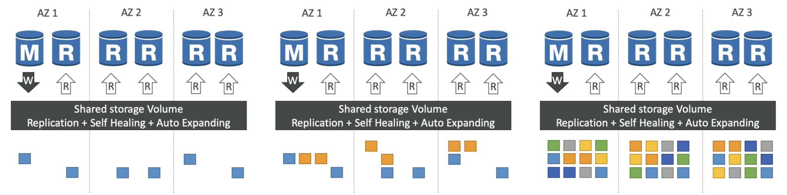

일부 데이터가 손상되거나 문제가 발생하면 백엔드에서 P2P 복제를 통해 자가복구를 수행합니다. 스토리지는 100개 이상의 볼륨에 스트라이핑을 사용하여 더 리스크를 줄입니다.

마스터 데이터베이스가 작동하지 않으면 약 30초 내로 failover가 발생합니다.

Aurora는 최대 15개의 읽기 전용 복제본을 생성할 수 있고, 읽기 전용 복제본은 다른 리전에 생성할 수 있습니다.

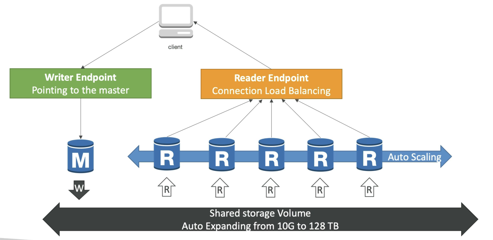

Aurora에서 쓰기 작업은 마스터 데이터베이스에서만 수행합니다. 마스터가 장애 조치로 인해 다른 복제본으로 전환될 수 있으므로, Writer Endpoint를 사용하여 마스터 데이터베이스에 접근합니다.

레플리카는 auto-scaling이 가능하며, 레플리카는 Reader Endpoint 통해 접근할 수 있으며, Reader Endpoint는 로드 밸런싱을 하여 읽기 작업을 여러 레플리카에 분산합니다.

## Auto Scaling

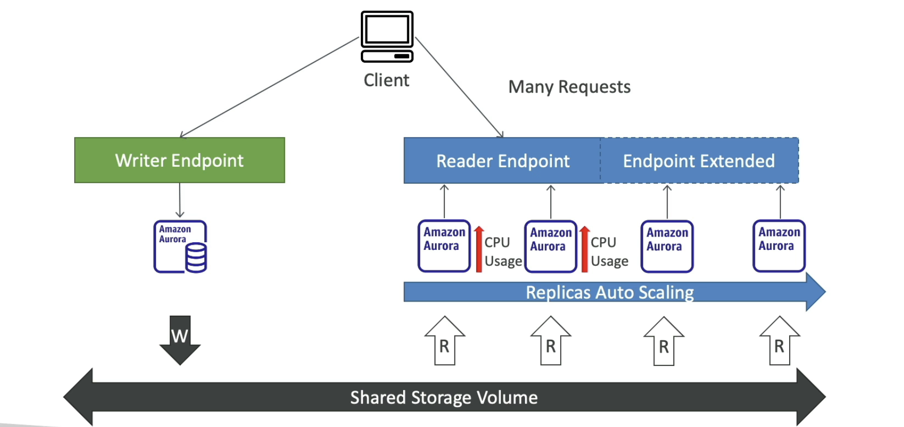

Aurora의 고급 기능에는 Auto Scaling이 있습니다. Auto Scaling은 읽기 전용 복제본을 자동으로 생성하고 삭제하여 읽기 작업을 분산합니다.

새로운 리플리카가 생성되면, 데이터베이스 클러스터의 Reader Endpoint가 자동으로 확장됩니다.

## Custom Endpoints

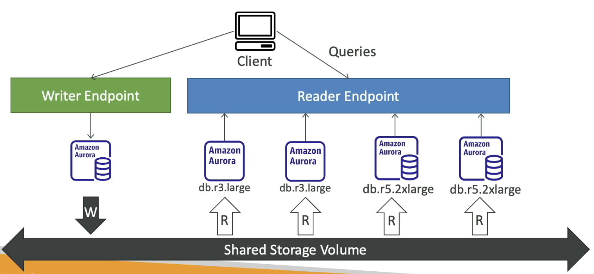

만약 여러 Aurora 인스턴스 클러스터를 서로 다른 업무 혹은 목적으로 사용해야한다면, Custom Endpoints를 사용하여 각 클러스터에 대한 엔드포인트를 생성할 수 있습니다.

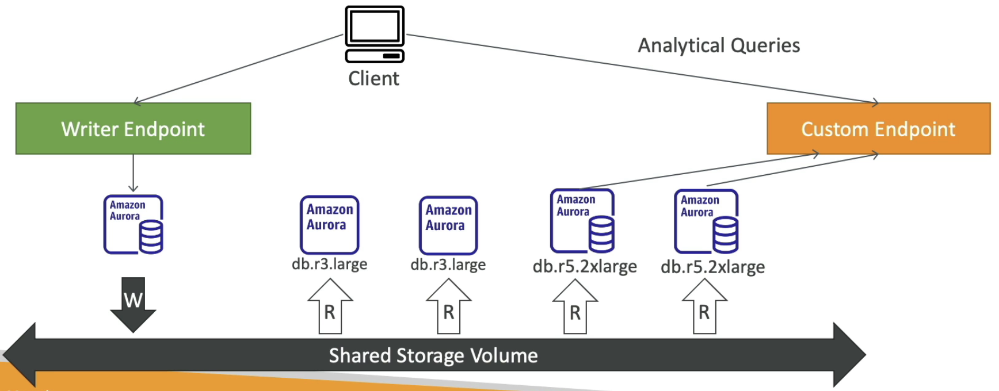

Custom Endpoints를 생성하면 기존의 Reader Endpoint는 사용되지 않기 때문에 업무마다 엔드포인터를 지정해야합니다.

## Serverless

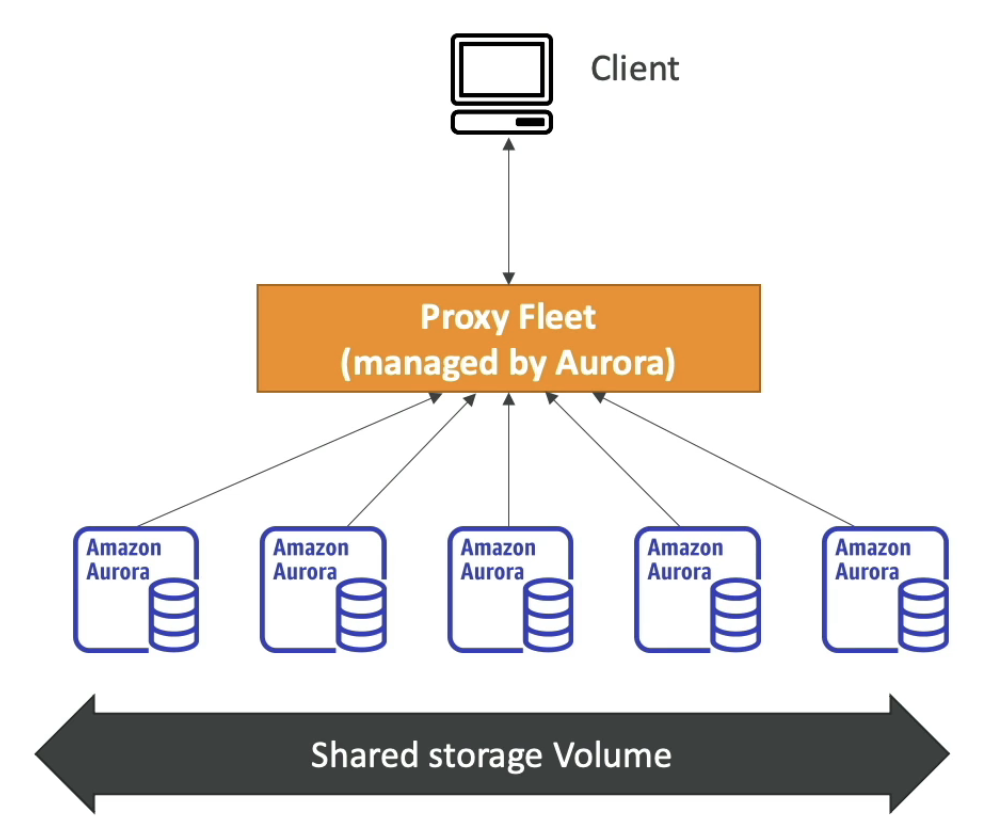

Aurora Serverless는 서버리스 데이터베이스 서비스로, 프록시 플릿을 사용하여 데이터베이스에 연결합니다.

업무량에 기반해 Aurora Serverless 데이터베이스가 생성되고, 프록시 플릿을 통해 데이터베이스에 접근합니다.

실제 사용량에 따라 데이터 베이스가 auto-scaling되기 때문에 비용이 효율적이므로 업무량을 예측하기 어려운 경우에 사용합니다.

## Global

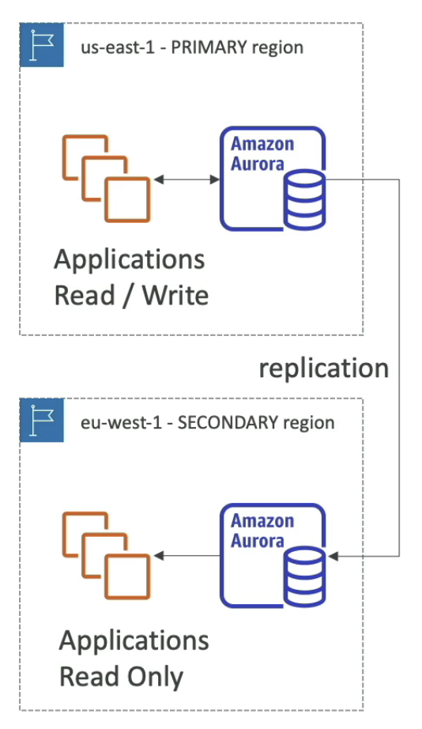

Global Aurora는 Aurora Cross-Region Replicas라고 불립니다.

최근에는 Aurora Global Database를 사용하는 것을 권장합니다.

평균적으로 Aurora Global Database에서 `다른 리전으로 데이터를 복제하는데 1초 이하의 시간`이 걸립니다.

## Machine Learning

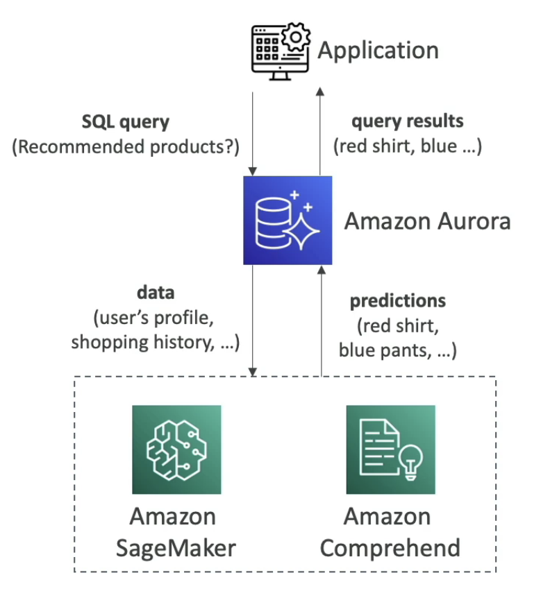

Aurora는 SageMaker, Comprehend와 같은 AWS ML의 서비스와 통합하여 사용할 수 있습니다. Aurora과 AWS ML을 통합하면 이상 행위 탐지, 광고 타겟팅, 감정 분석, 상품 추천 등 SQL 인터페이스를 통해 기계 학습 기반의 예측을 수행할 수 있습니다.

# 백업과 복원

## 백업

### RDS

* Automated Backups

Automated Backups는 데이터베이스를 자동으로 백업하는 기능입니다. Automated Backups는 데이터베이스를 일정한 시간 간격으로 백업하고, 보존 기간을 설정할 수 있습니다.

Automated Backups은 1~35일까지 보존할 수 있습니다. 0으로 설정하면 Automated Backups를 비활성화할 수 있습니다.

* Manual DB Snapshots

Manual DB Snapshots는 데이터베이스를 수동으로 백업하는 기능입니다. Manual DB Snapshots는 데이터베이스를 특정 시점으로 백업하고, 보존 기간을 설정할 수 있습니다.

수동 스냅샷은 원하는 기간 동안 보관할 수 있습니다.

> 스냅샷은 실제 스토리지보다 비용이 훨씬 저렴하기 때문에, 데이터베이스를 많이 사용하지 않는다면 스냅샷으로 보관하다가 필요할 때만 복원해서 사용하는 것이 좋습니다.

### Aura

* Automated Backups

Aurora의 경우 Automated Backups는 1 ~ 35일까지 보존할 수 있고, 비활성화는 불가능합니다.

point-in-time recovery를 지원하기 때문에 데이터베이스를 특정 시점으로 복원할 수 있습니다.

* Manual DB Snapshots

RDS와 동일합니다.

## 복원

### Restore options

RDS와 Aurora 모두 스냅샷을 사용하여 데이터베이스를 복원할 수 있습니다.

또한 S3를 사용해서 데이터베이스를 복원할 수 있습니다.

* RDS

RDS에서 S3의 데이터를 복원하기 위해서는 먼저 백업 파일을 온프레미스로 생성한 후 S3에 업로드하고, 데이터베이스를 복원할 때 RDS에서 S3 버킷의 백업 파일을 지정하여 복원하면 됩니다.

* Aurora

Aurora도 RDS와 동일하게 S3를 사용하여 데이터베이스를 복원할 수 있습니다. 다만 Aurora는 Percona XtraBackup을 사용해서 백업 파일을 생성해야 합니다.

이후 동작은 RDS와 동일합니다.

### Database Cloning

Aurora는 데이터베이스 복제를 지원합니다.

기존의 Aurora cluster에서 새로운 Aurora cluster를 생성하고, 데이터베이스를 복제할 수 있습니다.

Aurora Database Cloning은 COP(copy-on-write)를 사용하기 때문에 스냅샷을 찍고 복원하는 것보다 빠릅니다.

즉, 데이터베이스를 복제하는 시점에 데이터베이스를 복제하는 것이 아니라, 데이터베이스를 변경하는 시점에 해당 부분만 데이터를 복제합니다.

프로덕션 데이터베이스를 테스트 데이터베이스로 복제할 때 유용합니다.

# Security

RDS와 Aurora는 데이터베이스 보안을 위한 다양한 기능을 제공합니다.

* At-rest Encryption
  * AWS KMS를 사용하여 데이터베이스를 암호화합니다.
  * 마스터 데이터베이스가 암호화되지 않으면 레플리카도 암호화되지 않습니다.
  * 암호화되지 않은 데이터베이스를 암호화하려면 스냅샷을 생성하고, 암호화된 데이터베이스로 복원해야합니다.
* In-flight Encryption
  * SSL/TLS를 사용하여 데이터베이스와 클라이언트 간의 통신을 암호화합니다.
* IAM Authentication
  * 비밀번호 대신 IAM Role을 사용하여 데이터베이스에 연결할 수 있습니다.
* Security Groups
  * 데이터베이스에 대한 인바운드 및 아웃바운드 트래픽을 제어하는 방화벽 역할을 합니다.
* No SSH (except for RDS Custom)
  * RDS에는 SSH를 통해 데이터베이스에 연결할 수 없습니다.
* Audit Logs
  * 데이터베이스에 대한 모든 작업을 로깅합니다.
  * 로그 데이터는 시간이 지나면 사라집니다.
  * 로그 데이터를 보관하려면 CloudWatch Logs 전용 서비스를 사용해야합니다.

# Proxy

AWS에서는 RDS Proxy를 제공합니다.

RDS Proxy는 데이터베이스 연결을 관리하는 프록시 서버입니다.

RDS Proxy를 사용하면 데이터베이스 연결을 풀링(Pooling)하고, 데이터베이스 연결을 관리하고, 데이터베이스 연결을 모니터링할 수 있습니다.

데이터베이스에서 커넥션을 새로 생성하는 것보다 RDS Proxy를 사용하여 커넥션 풀을 관리하면 데이터베이스에 대한 부하를 줄일 수 있습니다.

RDS Proxy는 오토 스케일링을 지원하므로 용량을 관리할 필요가 없고 가용성을 높일 수 있습니다.

기본 인스턴스가 아니라 대기 인스턴스로 실행되며, 장애조치 시간을 크게 줄일 수 있습니다.

마지막으로 RDS Proxy를 통해서만 RDS에 접근하기 위해서 IAM 인증을 강제하면 보안을 더 강화할 수 있습니다.

RDS Proxy는 public access가 절대 불가능합니다. 반드시 VPC 내에서만 사용할 수 있습니다.

# ElastiCache

ElasitCache는 인메모리 데이터 스토어 서비스입니다.

ElasitCache는 Redis와 Memcached를 지원합니다.

Caches는 매우 높은 성능과 짧은 지연 시간을 가진 인메모리 데이터베이스입니다.

캐시를 사용하면 데이터베이스에 대한 쿼리 수를 줄이고, 데이터베이스의 부하를 줄일 수 있습니다.

ElastiCache를 사용하면 패치, 최적화, 설정, 구성, 모니터링 장애복구 등 RDS와 같이 AWS에서 관리합니다.

ElastiCache를 사용하기 위해서는 해당 캐시를 쿼리하도록 어플리케이션 코드를 변경해야합니다.

## ElastiCache Solution Architecture

### DB Cache

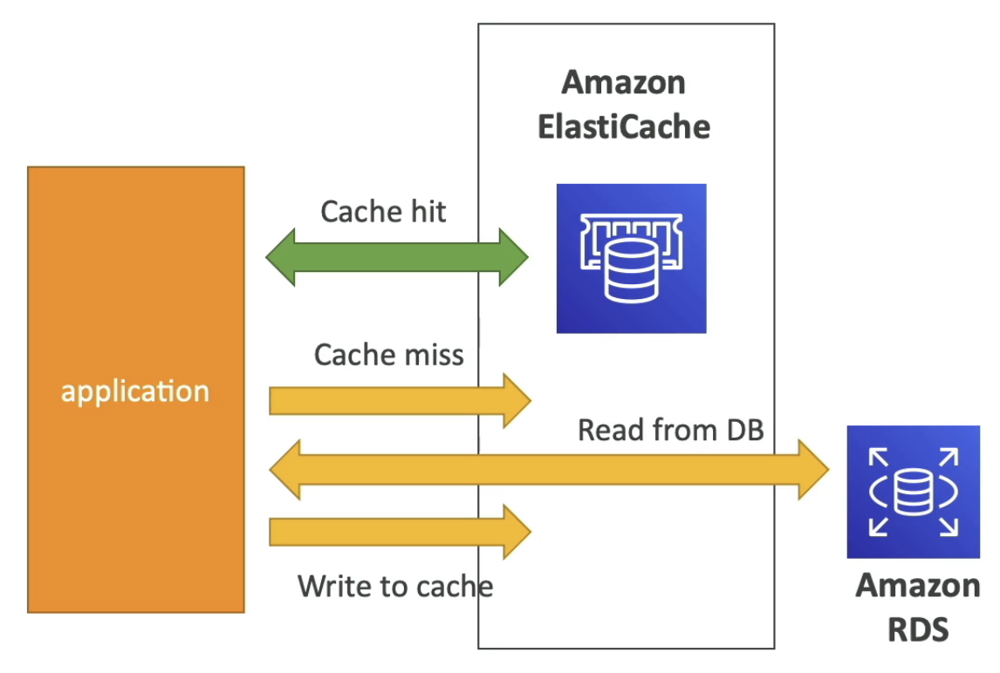

RDS의 쿼리 결과를 캐시하여 데이터베이스에 대한 쿼리 수를 줄이고, 데이터베이스의 부하를 줄이는 방법입니다.

캐시 히트가 발생하면 캐시에서 쿼리를 수행합니다.

캐시 미스가 발생하면 데이터베이스에 쿼리를 수행하고, 쿼리 결과를 캐시에 저장하여 다음에 쿼리할 때 캐시 히트가 발생하도록 합니다.

캐시 무효화 전략이 필요합니다. 캐시 무효화 전략은 데이터베이스에 데이터가 변경되면 최신 데이터를 제공하기 위해 캐시를 무효화하는 전략입니다.

### Session Store

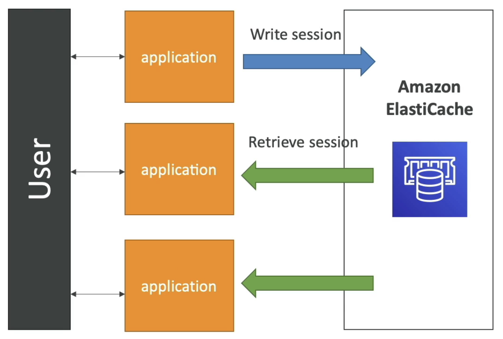

세션 스토어는 사용자의 정보를 저장하여 로그인 상태를 유지하는 방법입니다.

## Redis vs Memcached

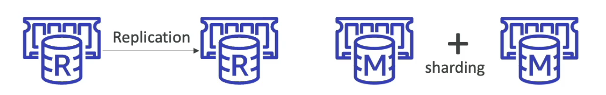

* Redis
  * Multi-AZ with Auto-Failover
  * Read Replicas
  * AOF Persistence
  * Backup and Restore
  * Supports Sets and Sorted Sets
* Memcached
  * Multi-node for partitioning (Sharding)
  * No Replicas
  * Non persistent
  * No backup and restore
  * Multi-threaded architecture

