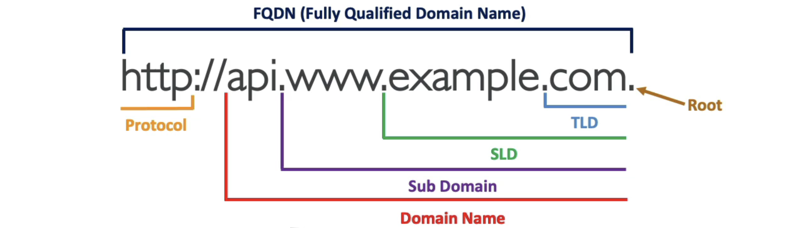
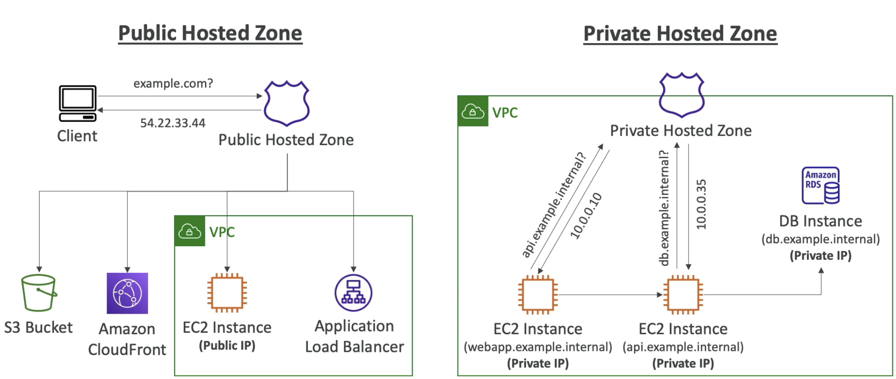
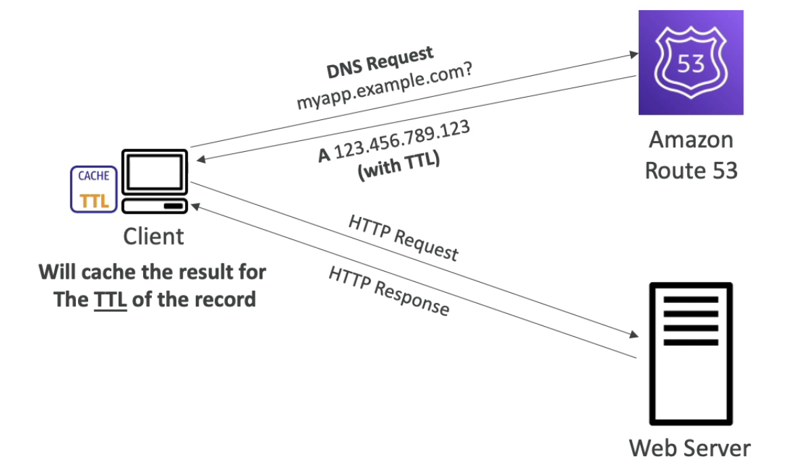
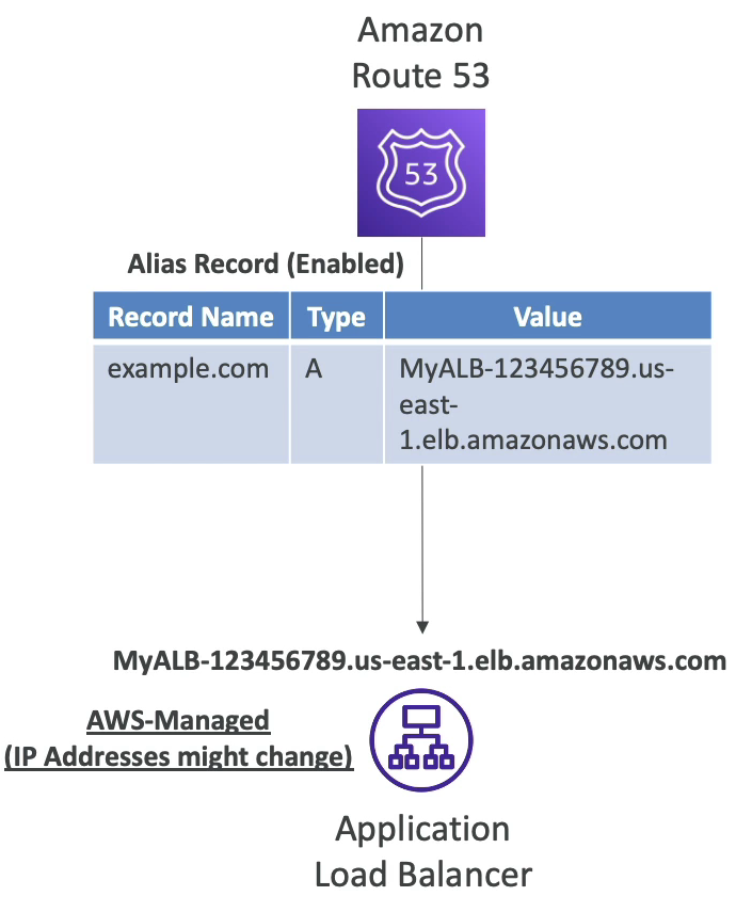

# Route 53

- [Route 53](#route-53)
  - [Route 53](#route-53-1)
    - [Records](#records)
    - [Record Types](#record-types)
  - [Hosted Zone](#hosted-zone)
  - [TTL](#ttl)
  - [CNAME과 Alias](#cname과-alias)
    - [Alias Record](#alias-record)

DNS는 Domain Name System의 약자로, 인터넷에서 호스트의 도메인 이름을 IP 주소로 변환하거나 그 반대의 역할을 하는 시스템입니다.

DNS는 계층적으로 구성되어 있으며, 최상위 계층부터 차례대로 `루트 도메인`, `상위 도메인`, `하위 도메인`으로 구성되어 있습니다.

## Route 53

Route 53은 AWS에서 제공하는 DNS 서비스입니다.
 
Route 53는 사용잦가 DNS `Record`를 제어하는 것이 가능합니다.

Route 53는 또한 Domain Registrar로서 도메인을 등록하고 관리할 수 있습니다.

Route 53를 통해 리소스에 대한 헬스 체크를 할 수 있습니다.

Route 53의 이름에 있는 53의 의미는 전통적으로 DNS 포트인 53번에서 유래되었습니다.

### Records

레코드란 DNS 서버에 저장된 정보를 의미합니다.

레코드에는 다음과 같은 정보가 포함됩니다.
- 도메인/서브도메인 이름
- 레코드 타입 (e.g. `A`, `AAAA`, `CNAME`, `NS`)
- 도메인 주소 (e.g. 142.58,14,51)
- 라우팅 정책
- TTL (Time to Live) : 레코드가 캐시에 저장되는 시간

### Record Types

- `A` : 도메인 이름을 IPv4 주소로 매핑
- `AAAA` : 도메인 이름을 IPv6 주소로 매핑
- `CNAME` : 도메인 이름을 다른 도메인 이름으로 매핑
  - DNS 네임스페이스의 Top-level domain에 대해서는 CNAME 레코드를 사용할 수 없습니다. (e.g. `example.com`)
- `NS` : 호스팅 영역(`Hosted Zone`)에 대한 네임 서버로 매핑
  - 라우팅 트래픽을 관리하기 위해 사용됩니다.

## Hosted Zone

호스팅 영역(`Hosted Zone`)은 AWS에서 호스팅하는 DNS 레코드 컨테이너입니다.

호스팅 영역은 도메인과 서브도메인으로 가는 트래픽의 라우팅을 관리합니다.

호스팅 영역에는 `Public Hosted Zone`과 `Private Hosted Zone`이 있습니다.

`Public Hosted Zone`은 인터넷에서 도메인 이름을 IP 주소로 변환하는데 사용되고, `Private Hosted Zone`은 VPC 내에서 도메인 이름을 IP 주소로 변환하는데 사용됩니다.

## TTL

TTL(Time to Live)은 DNS 레코드가 캐시에 저장되는 시간을 의미합니다.

TTL을 높게 설정하면 캐시에 저장되는 시간이 길어지므로 Route 53에 요청하는 횟수가 줄어들어 비용을 절약할 수 있습니다. 하지만 DNS 레코드를 업데이트하면 캐시에 저장된 레코드가 업데이트되기 전까지 이전 레코드를 사용하게 됩니다.

TTL을 낮게 설정하면 캐시에 저장되는 시간이 짧아지므로 Route 53에 요청하는 횟수가 늘어나게 됩니다. 하지만 DNS 레코드를 업데이트하면 캐시에 저장된 레코드가 빠르게 업데이트되어 새로운 레코드를 사용할 수 있습니다.

TTL은 Alias 레코드에는 적용되지 않습니다. Alias 레코드는 Route 53에서 자동으로 할당합니다.

## CNAME과 Alias

CloudFront, ELB 등의 AWS Resources는 hostname을 가지고 있습니다. 이를 특정 도메인에 연결하기 위해서는 CNAME을 사용하거나 Alias를 사용할 수 있습니다.

`CNAME`은 도메인 이름을 다른 도메인 이름으로 매핑하는 레코드 타입입니다. 루트 도메인에 대해서는 CNAME 레코드를 사용할 수 없습니다.

`Alias`는 AWS 리소스에 대한 DNS 레코드를 생성하는 레코드 타입입니다. CNAME과 다르게 루트 도메인에 대해서도 사용할 수 있습니다. 또한 무료이고 자체적인 헬스 체크를 제공합니다.

### Alias Record

Alias 레코드는 hostname을 특정 AWS 리소스에 연결하는 레코드 타입입니다.

이는 DNS의 확장 기능이므로 다른 DNS 서비스에서도 사용할 수 있습니다.

Alias 레코드는 리소스의 IP 주소가 변경되어도 자동으로 업데이트되므로 유지보수가 쉽습니다.

CNAME 레코드와 달리 루트 도메인에 대해서도 사용할 수 있습니다.

Alias 레코드는 항상 A/AAAA 레코드 타입으로 생성됩니다.

Alias 레코드를 사용하면 TTL을 설정할 수 없습니다.

Alias Record로 지정할 수 있는 Target은 다음과 같습니다.
- ELB
- CloudFront
- API Gateway
- Elastic Beanstalk
- S3
- VPC Endpoint
- Global Accelerator
- Route 53 Record in same Hosted Zone

> Note: Alias Record는 **EC2의 DNS 이름을 사용할 수 없습니다**. EC2의 DNS 이름은 인스턴스가 시작될 때마다 변경될 수 있기 때문입니다.
